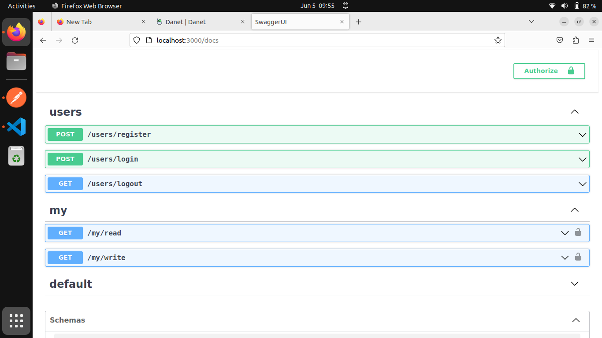

<p align="center">
   
</p>

## Description

module for manage users in project built usining Danet and postgresql. Danet is
web framework inspire from Nestjs but use Deno js as runtime instad of Node js.

## prerequest:

- deno installed in your machine
- postgres server installed, this project use this DB.

## Basic workflow

clone this reposetory. be inside the root of this project: create .env file copy
.env.example content into .env then fill the value for each env variable. in
this step you configure the parametres needed for connect to postgresql db. then
following commands:

```bash
$ deno task create-tables
$ deno task serve
```

by default the project will run on localhost port 3000.

## endpoints

swagger doc http://localhost:3000/docs


## still in progress

not yet complete, for example, I must add :

- data validation
- hash password and so one

# you can use it

you can use the content of this repo as need without any restriction: clone,
fork, redistrut...
